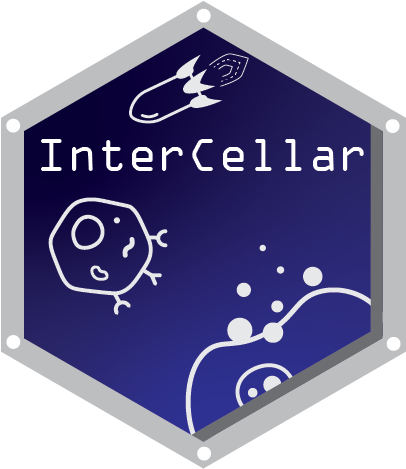

<!-- README.md is generated from README.Rmd. Please edit that file -->

```{r, include = FALSE}
knitr::opts_chunk$set(
  collapse = TRUE,
  comment = "#>",
  fig.path = "man/figures/README-",
  out.width = "100%"
)
```


<!-- badges: start -->
[](https://lifecycle.r-lib.org/articles/stages.html#stable)
[](http://bioconda.github.io/recipes/bioconductor-intercellar/README.html)

<!-- badges: end -->

# InterCellar 

an R/Shiny app for interactive analysis and exploration of cell-cell communication based on 
single-cell transcriptomics data


 
## Description

`InterCellar` allows researchers to interactively analyze the results
of cell-cell communication from scRNA-seq data. Starting from pre-computed ligand-receptor
interactions, `InterCellar` provides filtering options, annotations and multiple visualizations
to explore clusters, genes and functions. Moreover, based on functional annotation from Gene 
Ontology and pathway databases, `InterCellar` implements data-driven analyses to investigate
cell-cell communication in one or multiple conditions.

Every step of the analysis can be
performed interactively, thus not requiring any programming skills. Moreover,
`InterCellar` runs on your local machine, avoiding issues related to data privacy.

## Bioconductor release status

|      Branch      |    R CMD check   | Last updated |
|:----------------:|:----------------:|:------------:|
| [_devel_](http://bioconductor.org/packages/devel/bioc/html/InterCellar.html) | [](http://bioconductor.org/checkResults/devel/bioc-LATEST/InterCellar) |  |
| [_release_](http://bioconductor.org/packages/release/bioc/html/InterCellar.html) | [](http://bioconductor.org/checkResults/release/bioc-LATEST/InterCellar) |  |


## Installation

### Bioconductor

`InterCellar` is distributed as a [Bioconductor](https://www.bioconductor.org/) package and requires R (version 4.1) and Bioconductor (version 3.14).

To install `InterCellar` package enter:

```{r eval = FALSE}
if (!requireNamespace("BiocManager", quietly = TRUE))
    install.packages("BiocManager")

BiocManager::install("InterCellar")
```

### Bioconda and Docker

Alternatively, `InterCellar` can be installed through [Bioconda](https://bioconda.github.io/recipes/bioconductor-intercellar/README.html). We recommend installing `InterCellar` in a fresh environment, such as:

```{bash eval = FALSE}
conda create --name=intercellar_env 
conda activate intercellar_env
conda install bioconductor-intercellar
```

Once the installation is done, you can start R simply by 
 
```{bash eval = FALSE}
R
```

A third option would be to pull the docker container as indicated [here](https://bioconda.github.io/recipes/bioconductor-intercellar/README.html). See [bioconductor-intercellar/tags](https://quay.io/repository/biocontainers/bioconductor-intercellar?tab=tags) for valid values for <tag>, then run:

```{bash eval = FALSE}
docker pull quay.io/biocontainers/bioconductor-intercellar:<tag>
```

Lastly, you would need to run

```{bash eval = FALSE}
docker run -td quay.io/biocontainers/bioconductor-intercellar:<tag>
docker exec -it <container_ID> /bin/bash

R
```


## Launching the app

Once `InterCellar` is successfully installed, it can be loaded inside R or Rstudio as follow:

```{r eval = FALSE}
library(InterCellar)
```

In order to start the app, please run the following command:

```{r demostart, eval=FALSE}
InterCellar::run_app( reproducible = TRUE )
```

`InterCellar` should be opening in a browser. If this does not happen automatically, 
please open a browser and navigate to the address shown (for example, `Listening on http://127.0.0.1:6134`). The flag `reproducible = TRUE` ensures that your results will
be reproducible across R sessions.

## Troubleshooting

### Bioconductor

It might happen that the installation through `BiocManager` fails due to missing packages, throwing a similar error:

```{bash eval = FALSE}
ERROR: dependencies 'golem', 'ComplexHeatmap' are not available for package 'InterCellar' 
```

One solution would be to install the missing packages independently, such as:

```{r eval = FALSE}
BiocManager::install("ComplexHeatmap")
install.packages("golem")
```

And afterwards re-install `InterCellar`:

```{r eval = FALSE}
BiocManager::install("InterCellar")
```

### Bioconda and Docker

For users that have installed `InterCellar` through Bioconda or Docker, running `InterCellar::run_app()` might fail due to this error:

```{r eval=FALSE}
Error in utils::browseURL(appUrl) : 
  'browser' must be a non-empty character string
```

Try this solution:

```{r eval=FALSE}
# After starting R
options(browser="firefox")

# and then as usual
InterCellar::run_app( reproducible = TRUE )
```

## User Guide

First time here? Please have a look at `InterCellar` user guide [here](http://bioconductor.org/packages/devel/bioc/vignettes/InterCellar/inst/doc/user_guide.html).

## Paper reproducibility

Please have a look at [InterCellar-reproducibility](https://github.com/martaint/InterCellar-reproducibility) if you are interested in data and results showed in the [manuscript](https://www.researchsquare.com/article/rs-525466/v1).

## Help and Suggestions

If you have any question, problem or suggestion, please feel free to open an [issue](https://github.com/martaint/InterCellar/issues) or contact Marta Interlandi at [marta.interlandi@uni-muenster.de](mailto:marta.interlandi@uni-muenster.de)

## Citation

Marta Interlandi, Kornelius Kerl, Martin Dugas et al. Interactive analysis and exploration of cell-cell communication in single-cell transcriptomics with InterCellar, 21 June 2021, PREPRINT (Version 1) available at Research Square [https://doi.org/10.21203/rs.3.rs-525466/v1]

## Code of Conduct
  
  Please note that the InterCellar project is released with a [Contributor Code of Conduct](https://contributor-covenant.org/version/2/0/CODE_OF_CONDUCT.html). By contributing to this project, you agree to abide by its terms.
