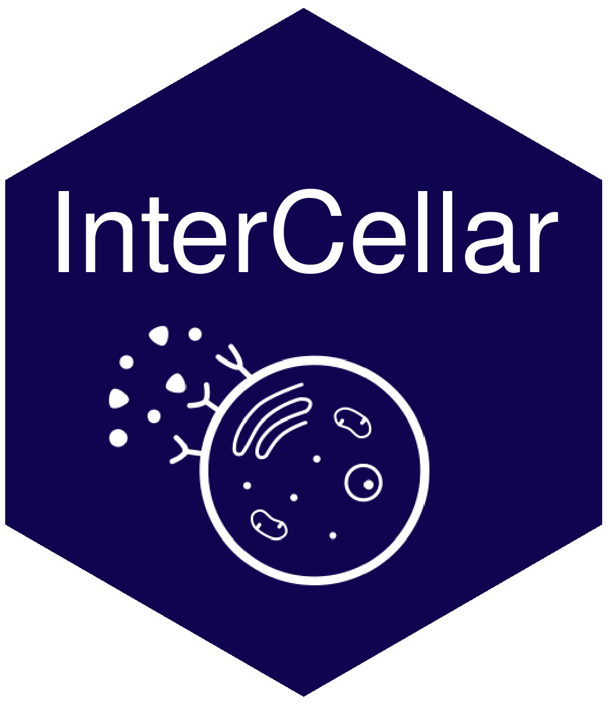

<!-- README.md is generated from README.Rmd. Please edit that file -->

<!-- badges: start -->

[](https://www.tidyverse.org/lifecycle/#experimental)
<!-- badges: end -->

# InterCellar 

an R-Shiny app for interactive analysis and exploration of cell-cell
communication based on single-cell transcriptomics data

## Description

`InterCellar` allows researchers to interactively analyze the results of
cell-cell communication from scRNA-seq data. Starting from pre-computed
ligand-receptor interactions, `InterCellar` provides three separate
views of the dataset (called `Universes`) to explore clusters, genes and
functions. Moreover, the user can analyze interaction-pair modules and
link them to significant functional terms from Pathways or Gene
Ontology.

## Installation

`InterCellar` is currently under revision in
[Bioconductor](https://www.bioconductor.org/).

You can install the development version from GitHub with:

``` r
# install.packages("remotes")
remotes::install_github("martaint/InterCellar", ref = "R4.0")
```

## Launching the app

Once `InterCellar` is successfully installed, it can be loaded as
follow:

``` r
library(InterCellar)
```

In order to start the app, please run the following command:

``` r
InterCellar::run_app( reproducible = TRUE)
```

`InterCellar` should be opening in a browser. If this does not happen
automatically, please open a browser and navigate to the address shown
(for example, `Listening on http://127.0.0.1:6134`). The flag
`reproducible = TRUE` ensures that your results will be reproducible
across R sessions.

## Vignettes

First time here? Please have a look at `InterCellar` user guide
[here](vignettes/user_guide.Rmd).

## Code of Conduct

Please note that the InterCellar project is released with a [Contributor
Code of
Conduct](https://contributor-covenant.org/version/2/0/CODE_OF_CONDUCT.html).
By contributing to this project, you agree to abide by its terms.
